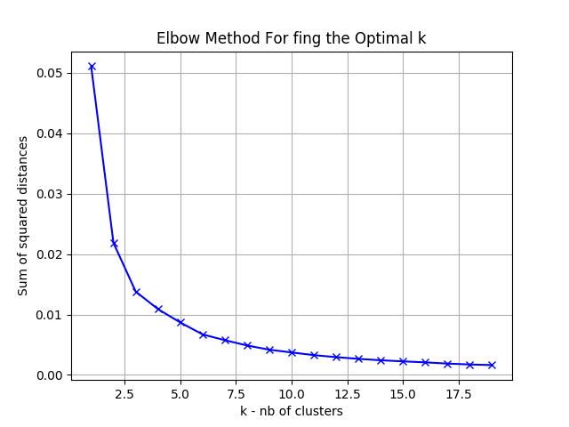
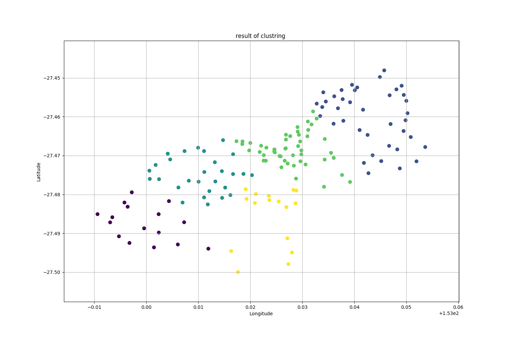

# Clustring  of CityBike‘s stations in Brisbane

The goal of this project is to to perform a clustering of CityBike‘s stations in Brisbane 
based on either the location or characteristics of bike stations. 
we use the algolithm of KMeans in this project


## Requirements

You need Python3 or later and pip  to run this project on unix machine.

python3 and pip can be installed using the following pip command
```
sudo apt-get install python3
sudo apt-get install python3-pip
```

To install the dependencies of this project(numpy,pandas,matplotlib,scikit-learn) using pip you should run this command
```
pip install -r requirements.txt
```

## Running the project

To run the code, you should specify some parameters in the file **config.json**  as follows

```
{
	"pathData": "../data/Brisbane_CityBike.json",
	"features": ["longitude","latitude"], 
	"nb_clusters":5, 
	"random_state":100 
}

```

- pathData : path to the file that contain the data
- features : features that we use to clusters the data
- nb_clusters : numbre of clusters
- random_state : Determines random number generation for centroid initialization. use in algorithm KMeans

after that you can run the file main.py passing in parameter the path to config file  as follows

```
python3 src/main.py config.json
```


## Structer of code 

- **main.py** : numbre of clusters
- **data_manger.py** : load data, save results, and load config
- **clustring.py** : train a clustering model whit k-means algorithm
- **k_selection.py** : returns the plot for the help us to determinite the optimal number
			 of clusters using the Elbrow method(not necessary in this project)

## Elbrow method to determinite the optimal number of clusters


<center> 
the optimal number of clusters using the Elbrow method in this case is around 4 and 5

## Output


The results of this project are saved in the folder *output* and are as follows:

- A CSV file containing the data and an additional column: **clusters** that specify the num of cluster of each row
- A image that contains the plot of the clustring data
[<center> ]

- folder of logs contain log for each execution


## Author

* **Ismail MOUSSAOUI** 


